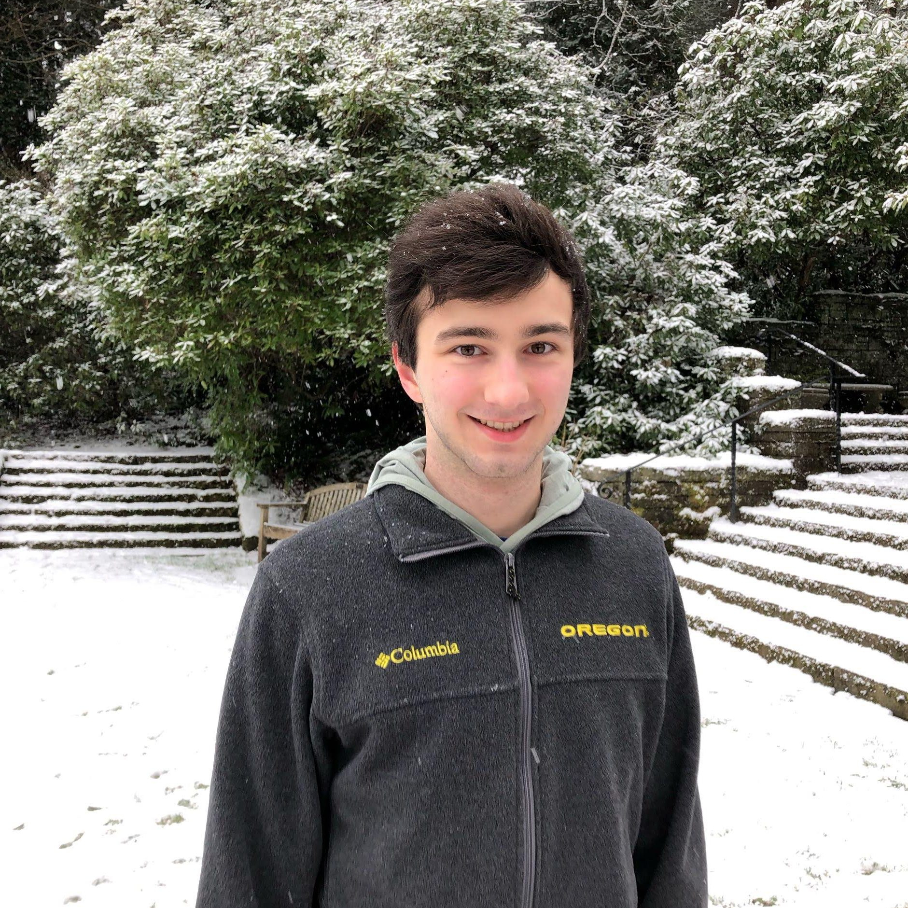

# About
I am a computer science student at Lewis & Clark College and a member of our local [ACM chapter](https://acm.watzek.cloud/).
I am mainly interested in computer security and software development.

- I was LC ACM's [featured student](https://acm.watzek.cloud/index.php/2019/03/13/featured-student-linus-brogan/).
- If you are scared of onions, check out the [Bon Onion Forecast](https://bon.linusaur.us/).
